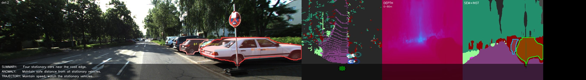
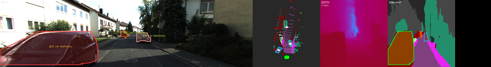
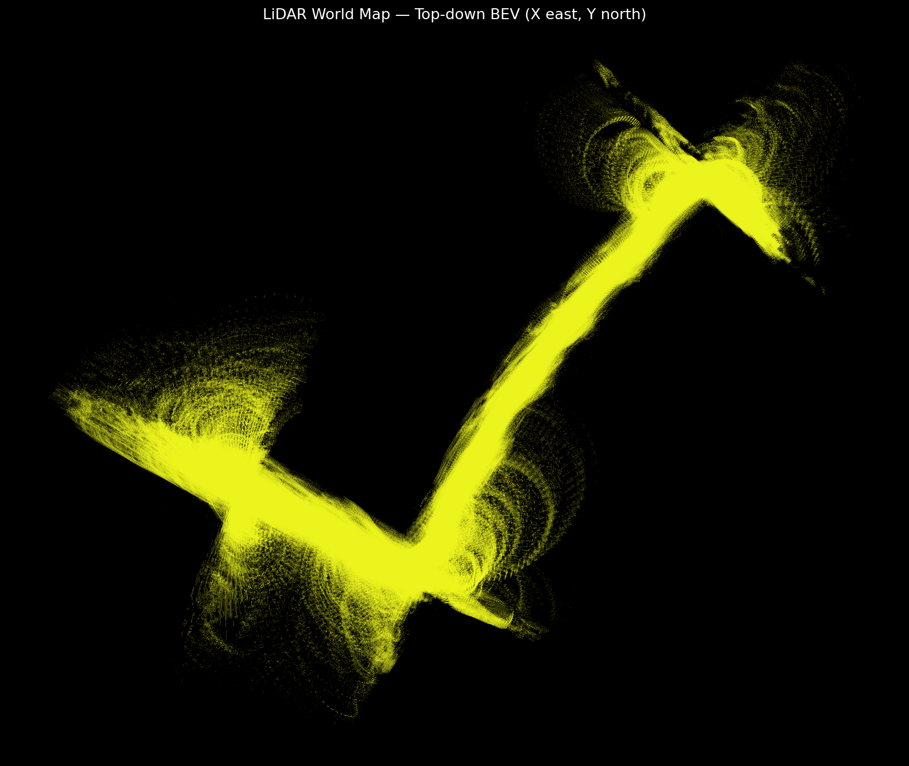

# Fusion Perception Pipeline

A multi-sensor autonomous driving perception pipeline that fuses monocular camera and LiDAR inputs using open-vocabulary 3D detection, Kalman + visual multi-object tracking, BEV occupancy mapping, monocular depth estimation, semantic road segmentation, and Gemma 4 language-based scene reasoning.

---

## Results - KITTI-360 Drive 
### Annotated composite (frame 100) — with Gemma scene caption

Each frame is a 4-panel composite: **camera view** (3D boxes + track IDs) · **BEV occupancy grid** · **depth map** · **semantic segmentation**.



> *Summary: "Four stationary cars near the road edge."
> Caution: Maintain a safe distance from the stationary vehicles."
> *Summary: "Maintain speed, watch the stationary vehicles."- Gemma 4 2B-IT*

---

### Raw composite (frame 300) — detection + tracking + BEV



---

### LiDAR world map — top-down BEV accumulated over full drive



> Accumulated LiDAR point cloud projected to the world frame via KITTI-360 pose transforms, rendered as a bird's-eye-view map.

---

## Architecture

```
Video / KITTI-360 sequence
         │
         ▼
 WildDet3D  ──────────────────────────────── open-vocabulary 3D detection
         │  Detection3D list per frame
         ├──► YOLO26 (2D fusion, optional)
         │
         ▼
 KalmanCoWTracker ────────────────────────── multi-object tracking
         │  ByteTrack two-stage association
         │  Kalman filter + CoWTracker pixel refinement
         │  Pose-based ego-motion compensation
         │
         ▼
 BEV Occupancy Grid ─────────────────────── LiDAR fusion + track centroids
         │  Exponential decay · LiDAR rasterisation (0.6) · tracks (1.0)
         │
         ├──► RoadSegmentor (YOLO26n-sem, Cityscapes semantic BEV)
         │
         ├──► MonoDepthEstimator (DA-V2 + LiDAR anchor)
         │
         ▼
 Gemma 4 2B-IT ──────────────────────────── language scene reasoning
         │  Natural-language summary + anomaly + recommended action
         │
         ▼
 Outputs: annotated video · detections.json · tracks.json · reasoning.json
          lidar_map.ply · map_topdown.png · eval_metrics.json
```

---

## Pipeline components

| Component | File | Description |
|-----------|------|-------------|
| 3D Detector | `fusion_perception/models/wilddet3d_wrapper.py` | [WildDet3D](https://github.com/allenai/WildDet3D) — open-vocabulary monocular 3D detection via text prompts |
| 2D Detector | `fusion_perception/models/yolo26_detector.py` | YOLO26 2D detector fused with WildDet3D boxes via IoU |
| Tracker | `fusion_perception/tracking/kalman_cowtracker.py` | Kalman filter + [CoWTracker](https://github.com/facebookresearch/co-tracker) visual tracking; ByteTrack two-stage association |
| Ego-motion | `fusion_perception/tracking/ego_motion.py` | Pose-based 3D ego-motion compensation from KITTI-360 `poses.txt` |
| BEV Grid | `fusion_perception/occupancy/bev_grid.py` | Bird's-eye-view occupancy: exponential decay → LiDAR rasterisation → track centroids |
| Road Segmentor | `fusion_perception/segmentation/road_segmentor.py` | YOLO26n-sem Cityscapes semantic labels projected onto BEV |
| Depth | `fusion_perception/depth/` | Depth-Anything-V2 monocular depth with LiDAR frustum anchoring and quality gate |
| Reasoner | `fusion_perception/models/gemma_wrapper.py` | Gemma 4 2B-IT with 4-bit quantisation; rolling scene-memory context |
| Prompt Builder | `fusion_perception/reasoning/prompt_builder.py` | Converts `SceneMemory` snapshots to structured scene descriptions |
| Data Loader | `fusion_perception/data/` | KITTI-360 frames, raw KITTI LiDAR, calibration, GT labels |
| Evaluation | `fusion_perception/evaluation/` | mAP · MOTA / MOTP · occupancy IoU; cross-dataset benchmark |

---

## Quickstart

### 1 — Install

```bash
pip install torch==2.5.1+cu121 torchvision==0.20.1+cu121 \
    --index-url https://download.pytorch.org/whl/cu121
pip install git+https://github.com/allenai/WildDet3D
pip install git+https://github.com/facebookresearch/co-tracker
pip install -e .
```

### 2 — Download WildDet3D checkpoint

```bash
mkdir -p ckpt
huggingface-cli download allenai/WildDet3D \
    wilddet3d_alldata_all_prompt_v1.0.pt --local-dir ckpt/
```

### 3 — Run on a video

```bash
python inference.py --video path/to/clip.mp4 --save-debug-frames
```

### 4 — Run on KITTI-360 (with LiDAR + evaluation)

```bash
python inference.py \
    --kitti360-root /data/KITTI-360 \
    --kitti360-seq  2013_05_28_drive_0000_sync \
    --max-frames 500 \
    --save-debug-frames --debug-every 50 \
    --eval
```

Outputs are written to `outputs/`:

```
outputs/
├── output.mp4            # annotated composite video
├── detections.json       # per-frame 3D detections
├── tracks.json           # track history with 3D centroid trajectories
├── reasoning.json        # Gemma reasoning outputs (prompt + summary)
├── eval_metrics.json     # mAP / MOTA / MOTP vs. KITTI-360 GT
├── lidar_map.ply         # accumulated world-frame point cloud
├── map_topdown.png       # top-down BEV render of lidar_map.ply
├── map_side.png          # side-view BEV render
├── stats.png             # per-frame detection / track count chart
└── debug_frames/
    ├── frame_000000.jpg      # raw composite (no caption overlay)
    ├── captioned_000000.jpg  # composite + Gemma caption overlay
    └── ...
```

---

## Google Colab

Open `notebooks/pipeline_finetune.ipynb` in Colab with a **T4 GPU** runtime.

Runs the full pipeline end-to-end on a KITTI sequence, then fine-tunes Gemma 4 2B on the collected reasoning outputs.

**Notebook sections:**
1. Mount Drive, install all dependencies
2. Download KITTI data, parse real camera intrinsics
3. Run pipeline (prints each reasoning output live)
4. Inspect training data — statistics, length histogram, example pairs
5. QLoRA fine-tuning with loss curve visualisation
6. Evaluate fine-tuned adapter vs. base model

---

## Configuration

All config lives in `configs/`. Configs are merged left-to-right at runtime:

```bash
python inference.py --config configs/default.yaml configs/colab.yaml --video clip.mp4
```

Key settings in `configs/default.yaml`:

```yaml
detection:
  prompts: ["car", "person", "cyclist"]   # open-vocabulary text prompts
  score_threshold: 0.4

tracking:
  backend: "kalman_cow"   # "kalman_cow" | "cowtracker"
  ego_motion: true        # pose-based 3D ego-motion compensation

depth:
  enabled: true
  model_size: "small"     # "small" | "base" | "large"
  lidar_anchor:
    enabled: true         # refine per-detection depth from LiDAR frustums

occupancy:
  resolution: 0.5         # metres per cell
  x_range: [-25.0, 25.0] # lateral range (metres)
  z_range: [-10.0, 60.0] # forward range (metres)

reasoning:
  enabled: true
  interval_frames: 30     # run Gemma every 30 frames
  quantize_4bit: true
```

---

## Fine-tuning Gemma 4 2B

Every `reasoning.json` entry contains `prompt_used` + `summary`, which become training pairs automatically:

```python
# Each entry becomes:
{
  "messages": [
    {"role": "user",      "content": "<scene prompt>"},
    {"role": "assistant", "content": "<gemma summary>"}
  ]
}
```

Fine-tuning uses HuggingFace `peft` + `trl` (QLoRA):

```python
from peft import PeftModel
from transformers import AutoModelForCausalLM

base  = AutoModelForCausalLM.from_pretrained("google/gemma-4-2b-it", ...)
model = PeftModel.from_pretrained(base, "ckpt/gemma4_lora")
```

See `notebooks/pipeline_finetune.ipynb` (Section 5) for the full training setup.

---

## Benchmarking

```python
from omegaconf import OmegaConf
from fusion_perception.evaluation import BenchmarkRunner

cfg = OmegaConf.merge(
    OmegaConf.load("configs/default.yaml"),
    OmegaConf.load("configs/benchmark.yaml"),
)
runner = BenchmarkRunner(cfg, datasets=["kitti-360", "waymo"], logs_per_dataset=3)
report = runner.run()
# Writes outputs/benchmark/<date>/report.md + report.json
```

Metrics reported per dataset and per log:

| Metric | Description |
|--------|-------------|
| **mAP** | Mean average precision at IoU 0.5 (BEV axis-aligned boxes) |
| **MOTA** | Multi-object tracking accuracy (CLEAR MOT) |
| **MOTP** | Multi-object tracking precision (mean BEV centre distance) |
| **Occ IoU** | Binary occupancy grid IoU vs. ground-truth LiDAR |

Requires `PY123D_DATA_ROOT` pointing to your datasets directory.

---

## Project structure

```
fusion_perception/
├── data/           # KITTI-360 / KITTI raw loaders, calibration, GT labels
├── depth/          # DA-V2 monocular depth, LiDAR anchor, quality gate
├── evaluation/     # metrics (mAP, MOTA, MOTP), benchmark runner
├── memory/         # Gemma rolling scene-memory buffer
├── models/         # WildDet3D, YOLO26, Gemma, frustum detector wrappers
├── occupancy/      # BEV grid with LiDAR fusion and exponential decay
├── pipelines/      # StageRunner (per-frame orchestration)
├── reasoning/      # prompt builder, Jinja2 templates
├── segmentation/   # YOLO26n-sem road segmentor
├── tracking/       # KalmanCoWTracker, ByteTrack association, ego-motion
├── utils/          # dataclasses, geometry, logging, video loader
└── visualization/  # BEV renderer, frame annotator, output compositor

configs/            # YAML configs (default, colab, benchmark, ...)
docs/               # assets (README images), plans, session notes
notebooks/          # Colab notebooks
scripts/            # one-off development / notebook-fix scripts
tests/              # pytest unit tests (~20 test files)
inference.py        # two-pass inference CLI (detection → Gemma)
run.py              # lightweight single-pass CLI entry-point
```

---

## Requirements

- Python 3.10+
- CUDA GPU with ≥10 GB VRAM (T4 or better for Colab)
- See `requirements.txt` for Python packages

---

## Known Issues & To Do

- **Try larger YOLO26 variants for better detection recall.**
  The current config uses `yolo26n` (nano) as the 2D detector. Upgrading to `yolo26s` or `yolo26m` should improve recall on small or partially-occluded vehicles at the cost of extra VRAM and inference time. Worth benchmarking against the existing mAP numbers on the KITTI-360 drive.

- **Fix ego-motion false-motion on suddenly-appearing parked cars.**
  When a stationary vehicle enters the field of view for the first time (e.g. a parked car that was occluded), the pose-based ego-motion compensator applies the ego-vehicle's displacement to its first observation. This makes the car's initial centroid jump, causing the tracker to assign it a non-zero velocity and label it as moving rather than stationary. Possible fixes to explore:
  - Hold new tracks in `TENTATIVE` state for more frames before committing a velocity estimate, so the initial jump can average out.
  - Gate velocity initialisation: only set a non-zero velocity if the centroid displacement across the first *N* confirmed frames exceeds a minimum threshold (e.g. 0.5 m).
  - Use LiDAR-based depth anchoring to verify whether the detection is consistent with a static background point cluster before assigning kinematic state.

---

## License

MIT
